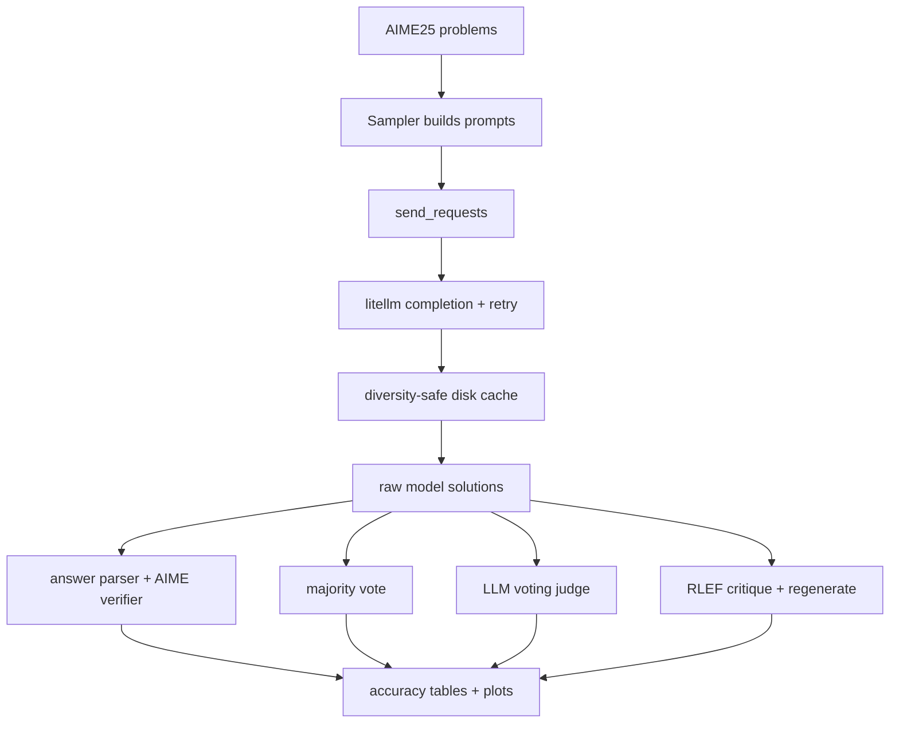
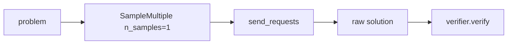
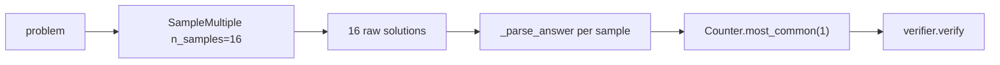
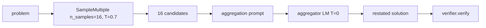
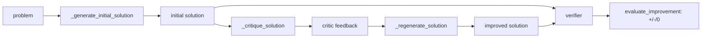

# HW1 Code Walkthrough

HW1 measures test-time compute strategies on AIME25 (30 competition-math
problems). The notebook `student_homework1.ipynb` orchestrates four strategies
that all share the same sampler, cache, and verifier.



## Important paths

| File | Role |
|------|------|
| `student_homework1.ipynb` | Runs zero-shot, majority vote, LLM voting, RLEF, and analysis cells. |
| `cs329_hw1/inference/litellm_models.py` | Provider-flexible inference wrapper with retry and occurrence-indexed cache keys. |
| `cs329_hw1/inference/_llm_cache.py` | Disk cache plus append-only call log. |
| `cs329_hw1/methods/simple_samplers.py` | `SampleMultiple`: sends N copies of each prompt through `send_requests`. |
| `cs329_hw1/methods/aime25_verifier.py` | Normalizes model output (`_parse_answer`) and verifies against the integer ground truth. |

## Cross-cutting: diversity-safe sampling

`temperature > 0` plus a naive cache would collapse 16 samples of the same prompt
to a single cached response, killing every method below. `send_requests` in
`litellm_models.py:122-150` solves this by assigning each duplicate prompt in a
batch an **occurrence index** and caching each occurrence separately:

```python
seen: Dict[str, int] = {}
occs: List[int] = []
for p in prompts:
    c = seen.get(p, 0)        # how many times have we seen this exact prompt?
    occs.append(c)
    seen[p] = c + 1
```

The cache key (`_make_completion_request`, `litellm_models.py:75-97`) embeds
`occ` next to `(model, messages, temperature, max_tokens)`. A re-run reproduces
the same N *diverse* samples instead of one.

## Part 1 — Zero-shot baseline



One sample per problem at `temperature=0`, scored directly by the AIME verifier.
Establishes the floor (0.400) on which every later technique is measured.

## Part 2 — Majority Voting



`_get_majority_answer` (notebook) is a one-liner over `collections.Counter` on
the normalized final integers. No reasoning — just plurality on parsed answers.
Peaks at n=4 (0.467) and decays beyond, because ~half the dataset shows
spread = 10–13 distinct answers across 16 samples (no signal to converge on).

## Part 3 — LLM Voting (generative reward model)



`LLMVoting.__call__` (`student_homework1.ipynb` cell ~11) wires two samplers:

1. **Generator** — `SampleMultiple(n_samples=16, temperature=0.7)`.
2. **Aggregator** — `SampleMultiple(n_samples=1, temperature=0)` with a system
   prompt telling the model it is a mathematical expert reviewing multiple
   solutions.

The aggregation prompt is the key design choice:

```python
"Based on these solutions, restate the solution here that you think is most
 likely correct."
```

The judge does not pick `Solution 3`, it **rewrites** the most-likely-correct
solution in its own words. That generative pathway is what lifts accuracy to
0.500, strictly dominating zero-shot. (The contrast with HW2's index-picking
judge — which scores below uniform random — is direct evidence that the
generative formulation matters.)

## Part 4 — RLEF (generate → critique → regenerate)



`SelfImprovementSystem` (notebook cell ~13) chains three calls into one
`improve_solution` method. All three roles are the **same Haiku model**:

| Method | Role | Temperature |
|--------|------|-------------|
| `_generate_initial_solution` | student | 0.7 |
| `_critique_solution` | critic ("mathematical critic" system prompt) | 0 |
| `_regenerate_solution` | rewriter (sees problem + draft + critique) | 0.7 |

`evaluate_improvement` scores both the original and improved answer with the
verifier and labels each problem `improved` / `regressed` / `unchanged`. The
result on AIME25 is −0.033 (1 improved, 2 regressed): the critic flags issues
on 30/30 problems including the 12 that were already correct, and the rewriter
dutifully complies. There is no oracle anywhere in the loop, so the feedback is
ungrounded.

## Main lesson

Two of the four parts share the same generate-then-aggregate skeleton but
differ in *who provides the aggregation signal*:

- **LLM Voting**: aggregator is asked to **write** the best solution → +0.100
  over zero-shot.
- **RLEF**: critic is asked to **find faults** in a single solution with no
  external reference → −0.033 over zero-shot.

The cache implementation is the unglamorous prerequisite that lets either
method be measured at all. Without the occurrence index, 16 stochastic samples
collapse to one on rerun and every metric becomes a lottery.
