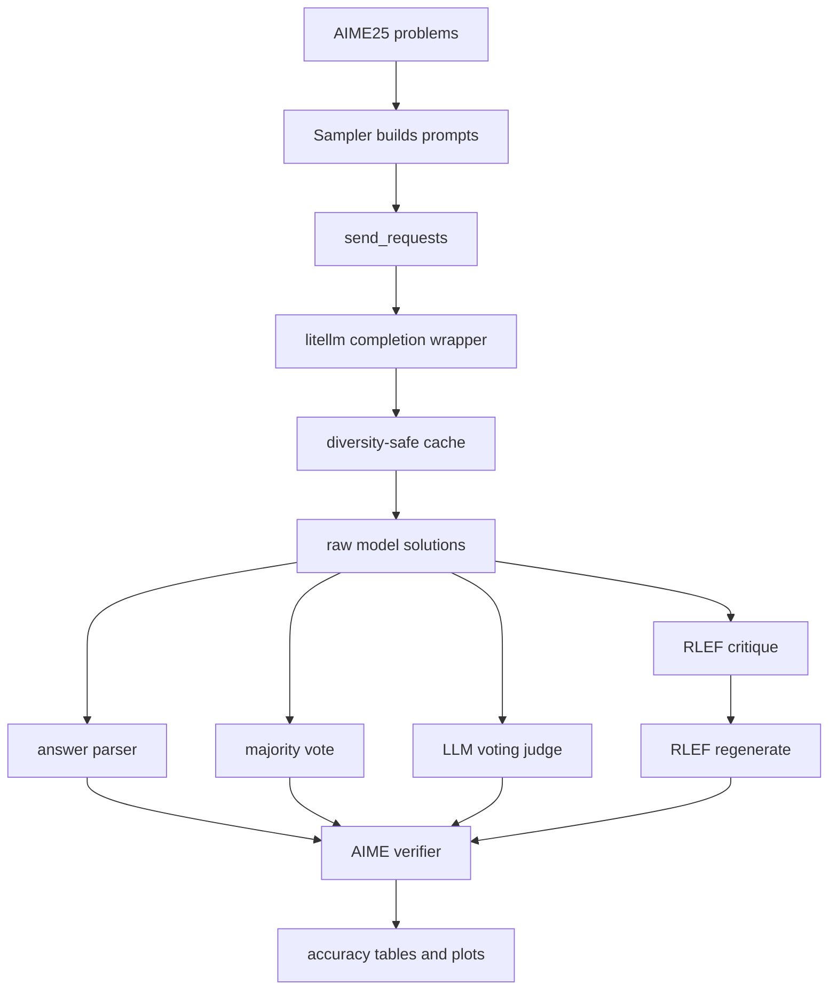

# HW1 Code Walkthrough

HW1 measures test-time compute strategies on AIME25. The main execution lives in
`student_homework1.ipynb`; model transport lives in
`cs329_hw1/inference/litellm_models.py`; caching lives in
`cs329_hw1/inference/_llm_cache.py`.

## Important paths

| File | Role |
|------|------|
| `student_homework1.ipynb` | Runs zero-shot, majority vote, LLM voting, RLEF, and analysis cells. |
| `cs329_hw1/inference/litellm_models.py` | Provider-flexible inference wrapper with retry and occurrence-indexed cache keys. |
| `cs329_hw1/inference/_llm_cache.py` | Disk cache plus append-only call log. |
| `cs329_hw1/methods/aime25_verifier.py` | Normalizes and verifies final answers. |

## Data flow

1. The notebook loads AIME25 and builds one or more prompts per problem.
2. `send_requests` assigns an occurrence index to identical prompts in the same
   sampling batch, then calls the cached litellm wrapper.
3. Verifiers parse final numeric answers from model text and score correctness.
4. Majority voting counts normalized final answers; LLM voting asks a judge model
   to synthesize the most likely correct solution from candidates.
5. RLEF chains initial generation, critique, and regeneration, then scores both
   original and improved answers.

## Main lesson

The cache implementation is not just a speed optimization. Without the
occurrence index, 16 stochastic samples of the same prompt would collapse to one
cached answer on rerun. The cache therefore preserves both reproducibility and
sampling diversity.
