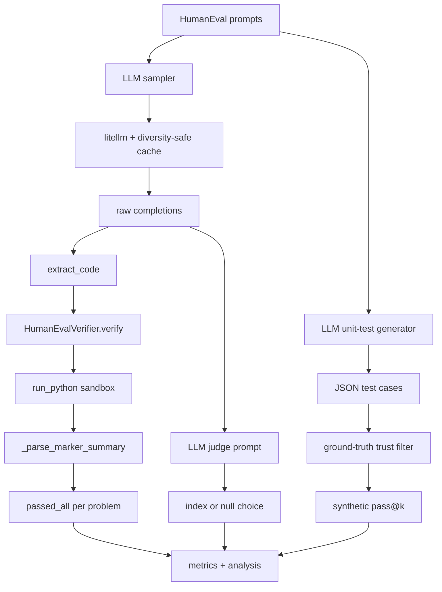
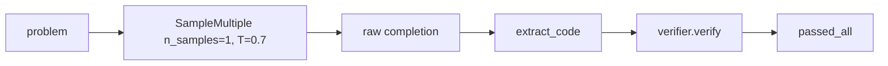
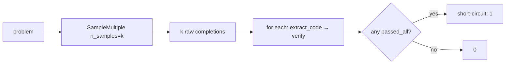
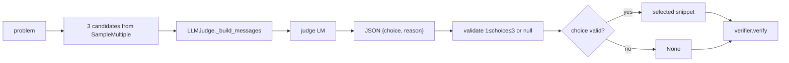
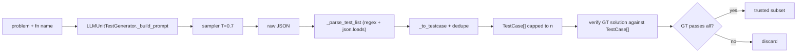
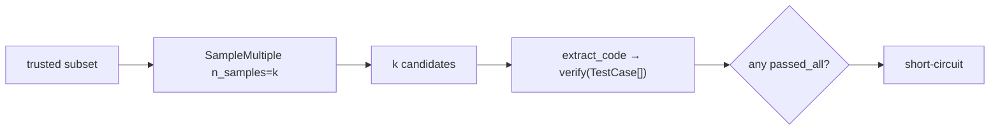

# HW2 Code Walkthrough

HW2 evaluates HumanEval code generation with real tests, pass@k sampling, an
LLM judge, and LLM-generated synthetic tests. The notebook is
`homework.ipynb`; the verification stack lives in `cs329_hw/methods/` and
`cs329_hw/run/`.



## Important paths

| File | Role |
|------|------|
| `homework.ipynb` | Runs zero-shot, pass@k, LLM judge, synthetic tests, written analysis; defines `extract_code` and `calculate_accuracy`. |
| `cs329_hw/openai_inference/litellm_models.py` | Provider-flexible generation wrapper with the same diversity-safe occurrence-index cache as HW1. |
| `cs329_hw/methods/verifiers.py` | `HumanEvalVerifier`: builds harness, parses markers. |
| `cs329_hw/run/sandbox.py` | `run_python`: subprocess sandbox with rlimits and timeout. |
| `cs329_hw/methods/llm_unit_test.py` | Builds the JSON test-case prompt, parses + dedupes the LLM's reply into `TestCase` objects. |
| `cs329_hw/methods/simple_samplers.py` | `SampleMultiple` reused from HW1 for pass@k. |

## Cross-cutting: the verification stack

Q1a, Q2a, and Q3b all reuse the same four-step chain:

```
LLM output (with ```python fences)
  │
  ├─ extract_code()                 homework.ipynb cell 8
  │    strip Markdown fences → bare Python string
  │
  ├─ HumanEvalVerifier.verify()     verifiers.py:38
  │    student code + test suite + marker harness → one self-contained .py
  │
  ├─ run_python()                   sandbox.py:59
  │    write temp file, subprocess (rlimits), capture stdout
  │
  └─ _parse_marker_summary()        verifiers.py:191
       scan stdout for __RESULT__ and __COUNTS__ markers
```

`extract_code` is a two-line regex; it does not validate syntax. ~19/26
zero-shot failures come from this — the model occasionally leaks reasoning
text like `Wait, let me reconsider...` between code lines, which makes the
extracted snippet invalid Python.

The harness monkey-patches `builtins.assert_` so failures *log* instead of
*raise*; that's why we can report `__COUNTS__= 5 / 7` instead of stopping at
the first failing case. The two layers of resource protection are
`subprocess.run(timeout=2)` and POSIX rlimits (`RLIMIT_CPU`, `RLIMIT_AS=256MB`,
`RLIMIT_FSIZE=16MB`, `RLIMIT_NPROC=64`), so `while True:` either blows the
timeout or gets SIGKILLed.

## Q1a — Zero-shot baseline



`calculate_accuracy` (notebook cell 10) loops over predictions, calls
`verifier.verify(code, fn_name, test_suite)`, counts `passed_all == True`.
Result: 0.841 (138/164).

## Q2a — pass@k sampling



`k_shot_acc` short-circuits as soon as one candidate passes all tests; the
remaining `k-1` sandbox runs for that problem are skipped. This is what makes
pass@9 affordable. Diminishing returns: pass@3 = 0.915, pass@9 = 0.939.

## Q2b–c — LLM-as-a-Judge (index-picking)



`LLMJudge.judge` prompts the model with the problem and three candidate code
blocks; the response must be one-line JSON `{"choice": 1|2|3|null, "reason":
"..."}`. The prompt explicitly allows `null` for "none of these look correct".

The empirical failure mode (notebook analysis cell):

| Scenario | Judge behaviour |
|----------|------------------|
| ≥1 candidate correct | picks correct **130** times, picks wrong **12**, says `null` **8** |
| All 3 candidates wrong | picks anyway **14/14**; says `null` **0/14** |

The judge has no "I don't know" calibration even when prompted with that
option. Combined with the 8 unnecessary `null`s, the final score (0.793) falls
**below** uniform-random selection (0.833). Compare with HW1's *generative*
voting: when the judge is asked to **rewrite** the best solution, it strictly
dominates zero-shot.

## Q3a — LLM-generated synthetic tests + trust filter



The generator (`llm_unit_test.py:34`) is a thin wrapper: build a JSON-schema
prompt, sample once, regex-strip code fences, `json.loads`, validate each item
has `name/args/kwargs/expected`, dedupe on `(args, kwargs)`, cap at N.

The trust filter is the crucial step: ground-truth code must pass the
synthetic suite, otherwise the test set is treated as wrong. 38/164 fail this
check (76.8% trust rate) — Sonnet writes plausible-looking tests with
incorrect `expected` values (e.g., `order_by_points` returns ordinary numeric
sort instead of sort-by-digit-sum). This is the same reasoning failure as code
generation, applied to writing oracles.

## Q3b — pass@k on the trusted subset



Same structure as Q2a, but `test_suite` is now `List[TestCase]` instead of the
HumanEval test string. `verifier.verify` routes to `_build_structured_harness`
(`verifiers.py:152`), which uses plain `==` comparison instead of monkey-patched
`assert_`. This introduces a quiet bug: `function returns (1, 1)` vs
`expected = [1, 1]` compares unequal even though the values match.

On the trusted subset: pass@3 with synthetic tests is 0.94 vs 0.92 with GT
tests. This is a selection effect — easier-to-solve problems also tend to have
easier-to-write tests — not a real win over ground truth.

## Main lesson

HW2 is mostly an *evaluation-design* story.

- The executable verifier (Q1a, Q2a) is a strong external oracle.
- The LLM judge (Q2b–c) and LLM-generated tests (Q3a) are **weak** verifiers
  that inherit the model's own miscalibration and reasoning errors.

The cheapest real-world lift on these numbers would be a smarter
`extract_code` (use `ast.parse` to find the largest valid Python subtree)
because invalid-Python failures, not algorithm failures, are the modal cause
of zero-shot errors.
