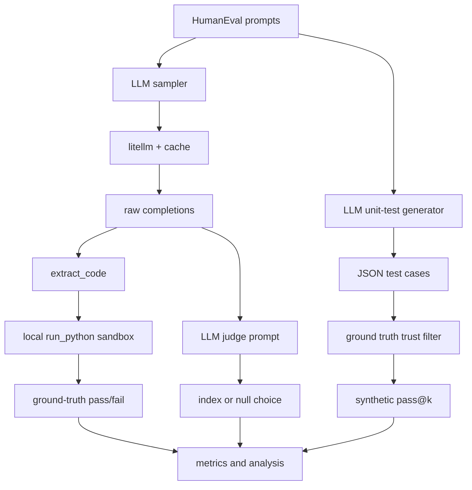

# HW2 Code Walkthrough

HW2 evaluates HumanEval code generation with real tests, pass@k sampling, an LLM
judge, and LLM-generated synthetic tests. The main execution lives in
`homework.ipynb`; model transport lives in
`cs329_hw/openai_inference/litellm_models.py`; the synthetic-test generator lives
in `cs329_hw/methods/llm_unit_test.py`.

## Important paths

| File | Role |
|------|------|
| `homework.ipynb` | Runs zero-shot, pass@k, LLM judge, synthetic tests, and written analysis. |
| `cs329_hw/openai_inference/litellm_models.py` | Provider-flexible generation wrapper with diversity-safe caching. |
| `cs329_hw/methods/llm_unit_test.py` | Builds prompts for JSON test-case generation and parses/deduplicates tests. |
| `cs329_hw/run/sandbox.py` | Local subprocess sandbox used because Docker is unavailable. |

## Data flow

1. The notebook samples code completions from Claude through the litellm wrapper.
2. `extract_code` strips Markdown fences and returns executable Python snippets.
3. The local sandbox runs snippets against HumanEval tests and returns pass/fail.
4. pass@k short-circuits as soon as any candidate passes all tests.
5. The LLM judge sees three candidates and must choose an index or `null`.
6. The synthetic-test generator emits JSON-style unit cases; ground-truth
   solutions must pass them before those tests are trusted for pass@k.

## Main lesson

HW2 is mostly an evaluation-design story. The executable verifier is a strong
oracle, while the LLM judge and LLM-generated tests are weak verifiers that
inherit model calibration and reasoning errors. The fastest practical lift would
be better code extraction, because many zero-shot failures are invalid Python
formatting rather than wrong algorithms.
