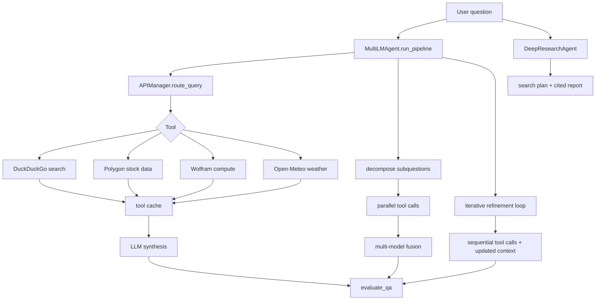

# HW3 Code Walkthrough

HW3 builds a tool-using QA agent. Natural-language questions are routed to web,
stock, math, or weather tools; answers are then improved through decomposition,
fusion, iterative refinement, and a deep-research path.

## Important paths

| File | Role |
|------|------|
| `homework3.ipynb` | Runs all assignment parts and records final outputs. |
| `cs329a_hw3/utils.py` | Central `generate_together` wrapper, `MODEL_MAP`, provider-specific parameter handling, and LLM cache. |
| `cs329a_hw3/api_manager.py` | Query router plus DuckDuckGo, Polygon, Wolfram, and Open-Meteo tool implementations. |
| `cs329a_hw3/multi_lm_agent.py` | Single-tool QA, decomposition, fusion, iterative refinement, and full pipeline orchestration. |
| `cs329a_hw3/DeepResearchAgent.py` | Search planning, evidence gathering, cited report generation. |

## Data flow

1. `run_pipeline` first tries to route the user question to the best external
   API, using strict JSON prompts and robust JSON extraction.
2. Tool calls are cached only on successful results, so transient API failures
   can retry on the next run.
3. Simple single-hop questions go through route -> tool -> synthesize.
4. Multi-hop questions can be decomposed into subquestions, answered through
   tools, and fused across multiple providers.
5. The iterative path keeps prior evidence in context and asks the model which
   tool query to run next, making it better for dependent subproblems.
6. `evaluate_qa` uses a separate model as a judge to score final answers.

## Main lesson

The router is not the bottleneck: it selected the right tool family for all 15
questions in inspection. Most residual errors happen after retrieval, when the
model must compare numbers, compute percentages, or reject misleading snippets.
The next improvement should make exact arithmetic/comparison a deterministic
post-processing step rather than another free-form language-model step.
