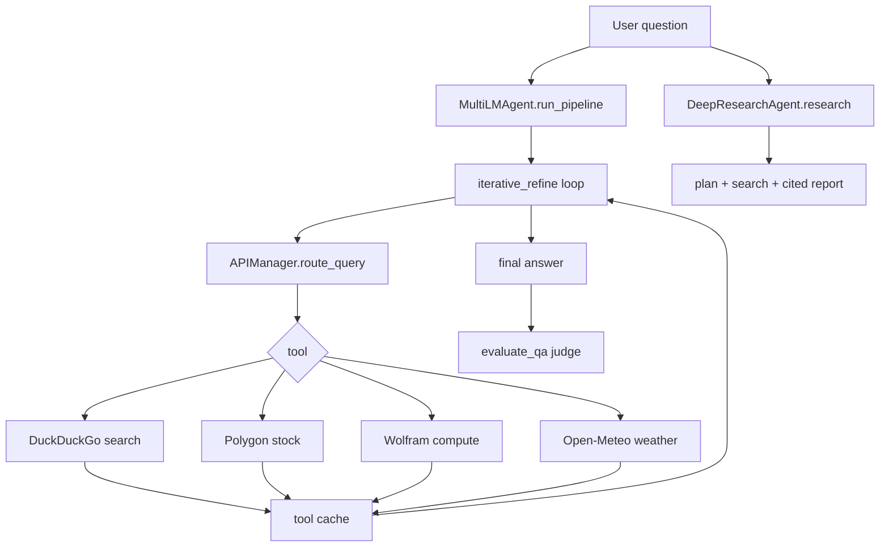
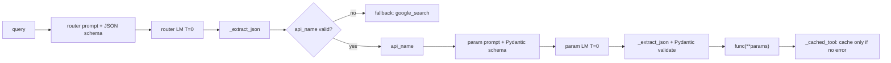
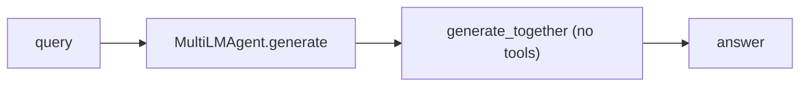
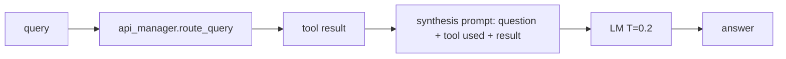
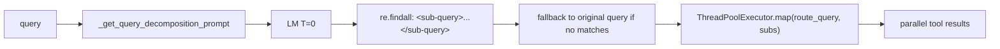
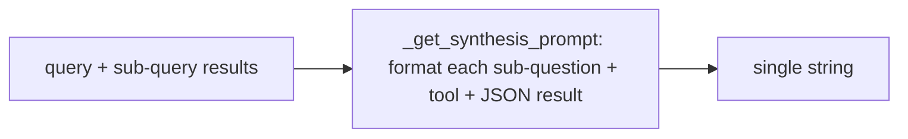
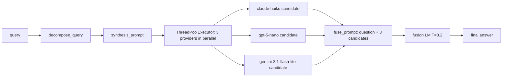
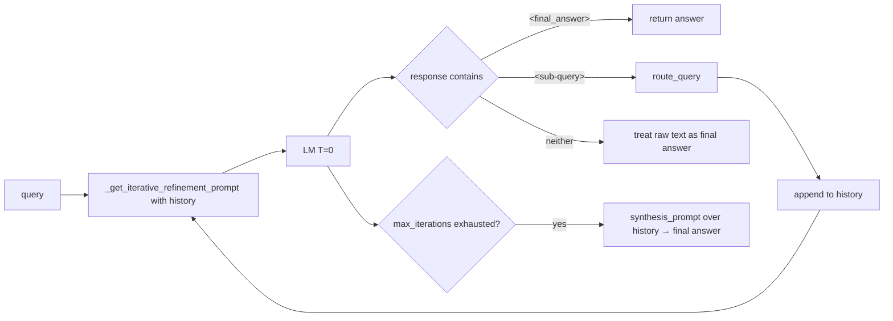
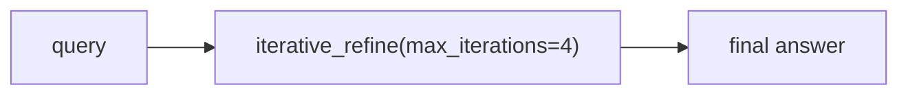

# HW3 Code Walkthrough

HW3 builds a tool-using QA agent on a 15-question dataset spanning math,
google, weather, and stock. Almost every "intelligent" behaviour in this
homework — routing, decomposition, refinement, fusion, deep research — is
implemented as **a prompt + an extractor**, not a learned policy. This
walkthrough is organised around that observation.

## Important paths

| File | Role |
|------|------|
| `homework3.ipynb` | Runs all assignment parts and records final outputs. |
| `cs329a_hw3/utils.py` | Central `generate_together` wrapper, `MODEL_MAP`, GPT-5 drop-temperature, defensive empty-`Message` fallback, LLM cache. |
| `cs329a_hw3/api_manager.py` | LLM router, parameter parser, four tool implementations (DDG / Polygon / Wolfram / Open-Meteo), success-only tool cache. |
| `cs329a_hw3/multi_lm_agent.py` | Single-tool QA, decomposition, fusion, iterative refinement, and `run_pipeline`. |
| `cs329a_hw3/DeepResearchAgent.py` | Search planning, evidence gathering, cited report generation. |
| `cs329a_hw3/evaluation.py` | Hard-coded 15-question dataset and `evaluate_qa` LLM-judge scoring. |

## Cross-cutting: routing is a prompt, not a router

`APIManager.route_query` (`api_manager.py:161-199`) and
`_parse_query_params` (`:122-159`) implement tool dispatch with two LM calls
and one fallback parser. There is no learned classifier anywhere.

Two design choices that keep this simple and robust:

- **`_extract_json`** (`api_manager.py:57-75`) tries `json.loads` on the whole
  reply first, then on the largest `{ ... }` substring. This is the safety net
  that lets the prompt-level "return only JSON" instruction work even when
  Anthropic ignores litellm's `response_format`.
- **`_cached_tool`** (`api_manager.py:17-34`) caches successful tool calls but
  **not errors**, so a transient DDG / Polygon outage retries on the next run
  instead of being pinned as a permanent miss.

Replaying all 15 questions through `route_query` selected the correct tool
family 15/15 times even on Haiku. Routing is not the bottleneck on this
dataset — reasoning on the routed results is.

## Part 0 — Single-LM baseline

`MultiLMAgent.generate` (`multi_lm_agent.py:37-51`) is a system+user prompt
through `generate_together`, no tools. Purpose: expose hallucination, stale
information, and arithmetic errors on real-time / external-fact questions
(20.0% on Haiku, 26.7% on Sonnet).

## Part 1 — API-augmented single-LM pipeline

`single_LM_with_single_API_call` (`multi_lm_agent.py:53-69`) is one
`route_query` followed by one synthesis LM call at `T=0.2`. The tool's JSON
result is `json.dumps`-ed and truncated to 3000 chars before being pasted
into the prompt. 62.5% on debug-8.

## Part 2 — Self-improvement techniques

Part 2 covers four self-improvement primitives. Each one is built from
**prompt + regex + a small amount of orchestration**.

### Part 2a — Query Decomposition (a prompt that asks the LM to write XML tags)

The three layers in `multi_lm_agent.py`:

| Step | Function | Mechanism |
|------|----------|-----------|
| 1 | `_get_query_decomposition_prompt` (`:71-87`) | Hard-coded planning prompt listing the 4 tool names; asks for **independent** sub-questions wrapped in `<sub-query>` tags. |
| 2 | `_get_sub_queries` (`:89-104`) | One LM call at `T=0`, `re.findall(r"<sub-query>(.*?)</sub-query>", ...)`, fallback to `[query]` if parsing yields nothing, cap at `max_sub_queries=4`. |
| 3 | `decompose_query` (`:106-123`) | `ThreadPoolExecutor.map` over `api_manager.route_query` per sub-query, parallel up to 4 workers. |

**The "decomposition" is not algorithmic.** It is a prompt instructing the LM
to emit XML-tagged sub-questions, followed by `re.findall` on those tags.
There is no semantic graph, no dependency analysis. The **"independent"**
constraint in the prompt is also the reason this strategy underperforms on
dependent multi-step questions: e.g. *"TSLA close × 1.112 = ?"* gets split
into `<sub-query>get TSLA close</sub-query><sub-query>multiply by 1.112
</sub-query>`, but the second sub-query has no way to see the first one's
answer in parallel execution. Iterative refinement (2d) fixes this.

### Part 2b — Synthesis Prompt

`_get_synthesis_prompt` (`:125-145`) is pure string formatting: each
sub-query becomes a block of `Sub-question i / Tool / Result` text. The
instruction *"Perform any final reasoning or arithmetic yourself"* is the
spot where small models often fail (see HW3's "TSLA close × 1.112" failure).

### Part 2c — Decompose + Multi-Provider Fusion

`decompose_and_fuse` (`:147-188`) samples the same `synthesis_prompt` across
three diverse providers (mapped through `MODEL_MAP` to Haiku / GPT-5-nano /
Gemini 3.1 Flash-Lite), then concatenates the three candidates into a fusion
prompt and calls the fusion model once at `T=0.2`. The fusion prompt
explicitly asks for *"resolving any disagreement in favour of the
best-justified response"* — selection without reasoning is once again the
weak link. 87.5% on debug-8.

### Part 2d — Iterative Refinement (sequential history)

`iterative_refine` (`:219-258`) is the structural opposite of 2c. The model
emits one of two tags per step:

- `<sub-query>...</sub-query>` → execute via `route_query`, append result to
  history, loop.
- `<final_answer>...</final_answer>` → done.

Because the prompt is re-built every step from the growing history
(`_get_iterative_refinement_prompt`, `:190-216`), each new sub-query can
condition on prior tool results. That is exactly what 2c cannot do, and it is
the entire reason 2d hits 100% on debug-8: questions like
*"TSLA close × 1.112"* go *"query close → 349.60 → query: 349.60 × 1.112
arithmetic → answer"*.

Hard cap is `max_iterations=3` by default; on exhaustion, we hand the
accumulated history to `_get_synthesis_prompt` and let the model write a
final answer from gathered evidence.

## Part 3 — `run_pipeline`

`run_pipeline` (`multi_lm_agent.py:262-268`) is a one-liner that calls
`iterative_refine` with `max_iterations=4`. The choice is documented in
comments: 2d strictly dominates 2c on the dependent-step questions in this
dataset.

Full 15-question accuracy:

| Stack | 70B slot | Judge | Fusion #3 | Accuracy |
|-------|----------|-------|-----------|----------|
| Current cheap | claude-haiku-4-5 | gpt-5-nano | gemini-3.1-flash-lite | **73.3%** (11/15) |
| Preserved | claude-sonnet-4-5 | gpt-4.1-nano | gemini-2.5-flash | **93.3%** (14/15) |

All 4 Haiku-stack failures are post-retrieval reasoning errors (arithmetic,
multi-day comparison, confabulation against snippets) except for one DDG
retrieval miss; see `docs/hw3.md` for the per-question breakdown.

## Part 4 — Deep Research Agent

```mermaid
flowchart LR
  A[query] --> B["plan_prompt: ask for &lt;q&gt;...&lt;/q&gt; web queries"]
  B --> C["sonnet-4-5 T=0.3"]
  C --> D["re.findall on &lt;q&gt; tags"]
  D --> E["for each: api_manager.google_search"]
  E --> F[evidence blocks + source URLs]
  F --> G["report_prompt: evidence + cite-only-given rules"]
  G --> H["sonnet-4-5 T=0.4 max_tokens=2000"]
  H --> I["{report, sources}"]
```

`DeepResearchAgent.research` (`DeepResearchAgent.py:34-112`) is the same
"prompt + tag-regex" pattern, applied to research planning and cited report
generation. The plan prompt asks for ≤4 web queries wrapped in `<q>` tags;
each runs through `google_search` (DDG fallback path), the top 12 evidence
blocks become the body of the report prompt, and the synthesis is constrained
to *"Do not invent facts beyond the evidence."*

This is the **only** agent in HW3 that **hardcodes `anthropic/claude-sonnet-4-5`**
inside the file (`:55, :97`); it bypasses `MODEL_MAP` and is unaffected by the
provider-stack changes. That's why the cache for the current Haiku run still
contains 6 sonnet calls.

## Main lessons

1. **Routing, decomposition, fusion, refinement, and research planning are
   all "prompt + extractor"**. There is no learned routing, no graph
   reasoning, no PPO. The agent's behaviour is determined almost entirely by
   prompt design and regex parsing.
2. **The router is not the bottleneck** — it picked the right tool family
   15/15. Residual errors are reasoning failures *after* retrieval: arithmetic,
   multi-day comparison, resisting misleading snippets.
3. **Iterative refinement dominates fusion** on this dataset because the
   prompt structure carries dependency information across steps. Fusion
   collapses to parallel independent sub-queries and loses that signal.
4. **The next high-ROI improvement is not another retrieval provider** but a
   deterministic post-processing step (Wolfram or local code) for arithmetic
   and comparisons that small orchestration models blur.
